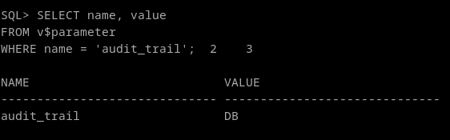
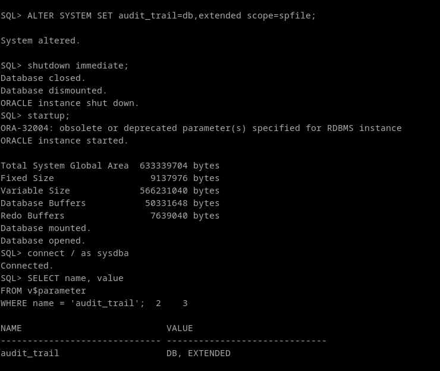
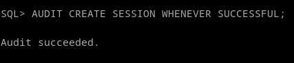
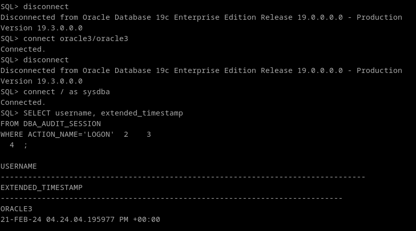

# 1. Activa desde SQL*Plus la auditoría de los intentos de acceso exitosos al sistema. Comprueba su funcionamiento.
Para comprobar si la auditoría, hay que ver el valor de la variable audit_trail
```
SELECT name, value 
FROM v$parameter 
WHERE name = 'audit_trail';
```



Puede tener los siguientes valores:

| **Politica**        | **Comportamiento**                                                          |
|---------------------|-----------------------------------------------------------------------------|
| **NONE:**           | La auditoría está desactivada                                               |
| **OS:**             | La auditoría se guarda en en un fichero del sistema en texto plano.         |
| **DB:**             | La auditoría se guarda en la base de datos, en la tabla SYS.AUD$            |
| **DB, EXTENDED:**   | Igual que db, pero rellena 2 columnas mas: una variable bind y el texto sql |
| **XML:**            | La auditoría se guarda en un fichero del sistema en formato xml.            |
| **XML, EXTENDED:**  | Igual que xml, pero incluye una variable bind y el texto sql                |

Para activar la auditoría, solo habría que cambiar esa variable con un alter system. 
Cambiandola sin mas, solo se cambiará en memoria, por lo que al reiniciar se cambiará de vuelta. Para cambiarla especificamos el alcance del cambio (scope=spfile). Vamos a cambiarlo al modo extendido para probar:

```
ALTER SYSTEM SET audit_trail=db,extended scope=spfile;
```




Finalmente, activamos la auditoría para el comando “create session” y le especificamos que solo lo guarde cuando tenga éxito.
```
AUDIT CREATE SESSION WHENEVER SUCCESSFUL;
```



Consultaremos una de las vistas del diccionario que corresponde a aud$:
```
SELECT username, extended_timestamp
FROM DBA_AUDIT_SESSION
WHERE ACTION_NAME='LOGON';
```

