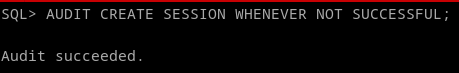
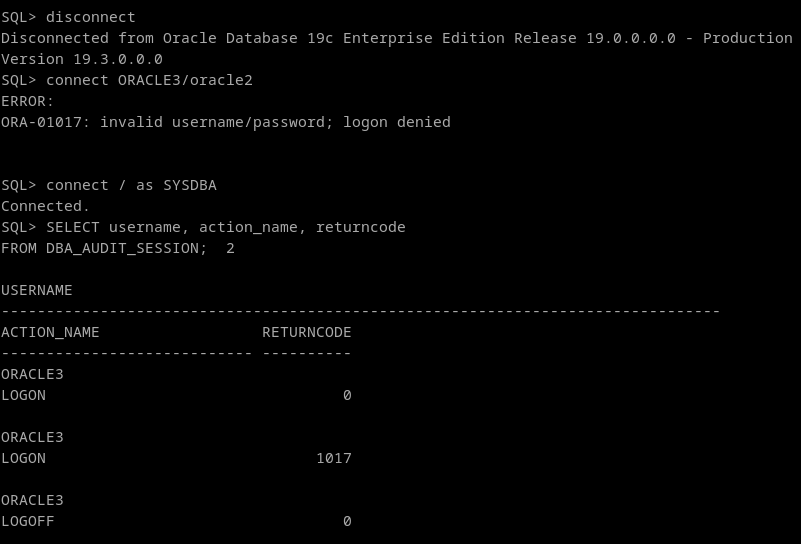
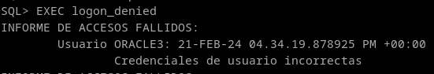

# 2. Realiza un procedimiento en PL/SQL que te muestre los accesos fallidos junto con el motivo de los mismos, transformando el código de error almacenado en un mensaje de texto comprensible. Contempla todos los motivos posibles para que un acceso sea fallido.

Primero de todo hay que registrar los no-éxitos. Ya tenemos el comando para registrar los intentos no exitosos, así que solo hay que adaptarlo para lo contrario:
```
AUDIT CREATE SESSION WHENEVER NOT SUCCESSFUL;
```


El código de error ora-1017 corresponde a usuario/contraseña inválidos. Todos los errores los he encontrado de estas fuentes:
https://www.dba-oracle.com/t_error_code_list.htm
https://johanlouwers.blogspot.com/2013/01/oracle-database-login-audit.html 

```
SELECT username, action_name, returncode
FROM DBA_AUDIT_SESSION;
```



El procedimiento:

```
CREATE OR REPLACE PROCEDURE logon_denied AS
    CURSOR c_logon IS
        SELECT username, extended_timestamp, returncode
        FROM DBA_AUDIT_SESSION
        WHERE returncode != 0;
BEGIN
    FOR i IN c_logon LOOP
        dbms_output.put_line('INFORME DE ACCESOS FALLIDOS:');
        dbms_output.put_line(chr(9) || 'Usuario ' || i.username || ': ' || i.extended_timestamp);
        CASE i.returncode
            WHEN 911 THEN
                dbms_output.put_line(chr(9) || chr(9) || 'El usuario o contrasena contiene un caracter no valido');
            WHEN 988 THEN
                dbms_output.put_line(chr(9) || chr(9) || 'No se ha especificado contrasena');
            WHEN 1004 THEN
                dbms_output.put_line(chr(9) || chr(9) || 'Inicio de sesión automático denegado. (No se ha especificado usuario ni contrasena)');
            WHEN 1005 THEN
                dbms_output.put_line(chr(9) || chr(9) || 'La contrasena introducida es NULL');
            WHEN 1017 THEN
                dbms_output.put_line(chr(9) || chr(9) || 'Credenciales de usuario incorrectas');
            WHEN 1031 THEN
                dbms_output.put_line(chr(9) || chr(9) || 'Sin privilegios del sistema operativo para la conexión');
            WHEN 1040 THEN
                dbms_output.put_line(chr(9) || chr(9) || 'La contrasena contiene carcteres prohibidos');
            WHEN 1045 THEN
                dbms_output.put_line(chr(9) || chr(9) || 'Sin privilegios para crear sesion (CREATE SESSION)');
            WHEN 1918 THEN
                dbms_output.put_line(chr(9) || chr(9) || 'El usuario no existe');
            WHEN 1920 THEN
                dbms_output.put_line(chr(9) || chr(9) || 'El rol no existe');
            WHEN 1988 THEN
                dbms_output.put_line(chr(9) || chr(9) || 'Las conexiones remotas estan deshabilitadas');
            WHEN 9272 THEN
                dbms_output.put_line(chr(9) || chr(9) || 'Error de conexion del adaptador o el OSD');
            WHEN 9911 THEN
                dbms_output.put_line(chr(9) || chr(9) || 'Credenciales incorrectas');
            WHEN 12672 THEN
                dbms_output.put_line(chr(9) || chr(9) || 'Fallo en la autentificación de la conexión (incompatibilidad entre versiones, problemas del adaptador...)');
            WHEN 28000 THEN
                dbms_output.put_line(chr(9) || chr(9) || 'La contrasena ha caducado');
            WHEN 28002 THEN
                dbms_output.put_line(chr(9) || chr(9) || 'La contrasena caducara pronto');
            WHEN 28003 THEN
                dbms_output.put_line(chr(9) || chr(9) || 'La contrasena no es lo suficientemente compleja');
            WHEN 28007 THEN
                dbms_output.put_line(chr(9) || chr(9) || 'La contrasena no puede ser reutilizada');
            WHEN 28008 THEN
                dbms_output.put_line(chr(9) || chr(9) || 'La Contraseña antigua fué cambiada');
            WHEN 28009 THEN
                dbms_output.put_line(chr(9) || chr(9) || 'La conexion al usuario sys debería hacerse como sysdba o sysoper.');
            WHEN 28011 THEN
                dbms_output.put_line(chr(9) || chr(9) || 'La cuenta caducara pronto');
            WHEN 28221 THEN
                dbms_output.put_line(chr(9) || chr(9) || 'La contrasena original no ha sido proporcionada en el cambio de contraseña. (REPLACE)');   
        END CASE;
    END LOOP;
END;
/

EXEC logon_denied
```

