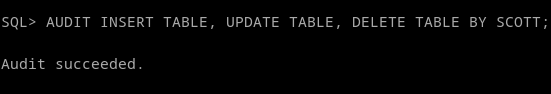
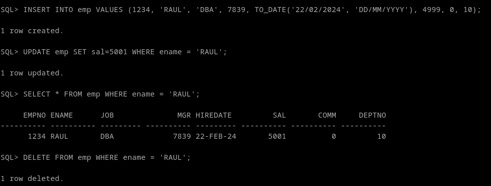
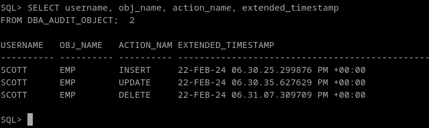

# 3. Activa la auditoría de las operaciones DML realizadas por SCOTT. Comprueba su funcionamiento.

**NOTA:** Para limpiar los registros de ejercicios anteriores y obtener resultados limpios solo hay que borrar el contenido de la tabla sys.aud$
```
DELETE FROM SYS.AUD$
```

Activamos la auditoría para el DML de SCOTT:
```
AUDIT INSERT TABLE, UPDATE TABLE, DELETE TABLE BY SCOTT;
```


Nos conectamos con la cuenta scott y hacemos operaciones DML:
```
INSERT INTO emp VALUES (1234, 'RAUL', 'DBA', 7839, TO_DATE('22/02/2024', 'DD/MM/YYYY'), 4999, 0, 10);
UPDATE emp SET sal=5001 WHERE ename = 'RAUL';
SELECT * FROM emp WHERE ename = 'RAUL';
DELETE FROM emp WHERE ename = 'RAUL';
```


Volvemos a sys, y comprobamos la vista para objetos:
```
SELECT username, obj_name, action_name, extended_timestamp 
FROM DBA_AUDIT_OBJECT;
```



