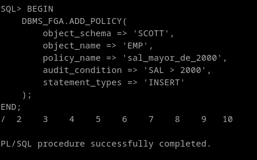
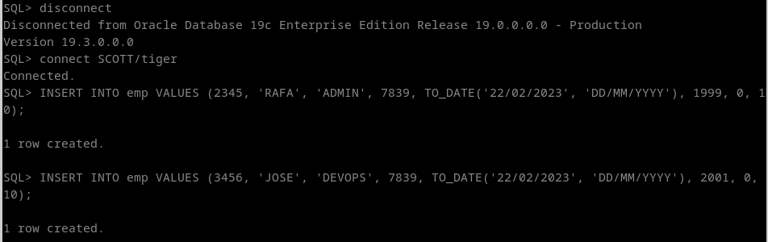
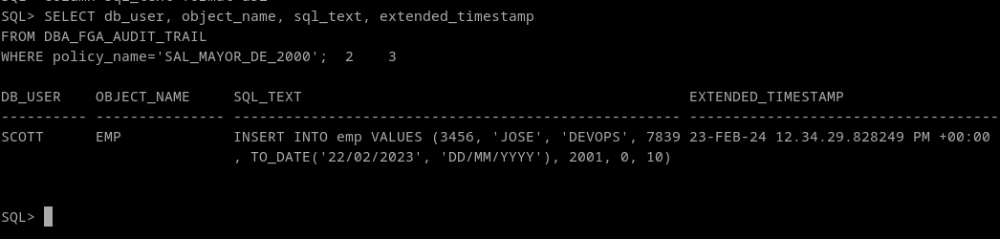

# 4. Realiza una auditoría de grano fino para almacenar información sobre la inserción de empleados con sueldo superior a 2000 en la tabla emp de scott.

La auditoría de grano fino (fine-grained auditing) es un tipo de auditoría extendida. la librería FGA viene por defecto con la instalación de oracle.
Los posibles parámetros son:

| **Parametro**     | **Descripcion**                                                                                                                                           |
|-------------------|-------------------------------------------------------------------------------------------------------------------------------------------------------|
| object_schema     | Esquema del objeto a auditar. NULL = Utiliza el esquema actual del usuario logueado                                                                   |
| object_name       | Nombre del objeto a auditar.                                                                                                                          |
| policy_name       | Nombre único de la política.                                                                                                                          |
| audit_condition   | Condición en la columna a auditar                                                                                                                     |
| audit_column      | Columnas a las que tiene acceso la política. NULL = cualquier columna.                                                                                |
| handler_schema    | Esquema que contiene el event handler. NULL = esquema actual.                                                                                         |
| handler_module    | Nombre de la función event handler. Si el procedimiento falla con una excepción, la declaración SQL del usuario también fallará.                      |
| enable            | Habilitar auditoría. Booleano. Default = TRUE                                                                                                         |
| statement_types   | Tipos de SQL a los que aplica: INSERT, UPDATE, DELETE o SELECT.                                                                                       |
| audit_trail       | El destino (DB o XML) de los registros de la auditoría. También tiene soporte para el Extended en la tabla SYS.FGA_LOG$.                              |
| audit_column_opts | Establece si se audita cuando la consulta es sobre a una columna especificada en audit_column, o solo cuando se hace referencia a todas la columnas.  |
| policy_owner      | dueño de la política de auditoría. Este parámetro no es especificado por el usuario. Lo usa oracle internamente para la creación de las politicas FGA.|


Creamos una política de auditoría con lo que dice el enunciado:

```
BEGIN
    DBMS_FGA.ADD_POLICY(
        object_schema => 'SCOTT',
        object_name => 'EMP',
        policy_name => 'sal_mayor_de_2000',
        audit_condition => 'SAL > 2000',
        statement_types => 'INSERT'
    );
END;
/
```



Nos conectamos como scott y hacemos inserts que activen esta política:

```
INSERT INTO emp VALUES (2345, 'RAFA', 'ADMIN', 7839, TO_DATE('22/02/2024', 'DD/MM/YYYY'), 1999, 0, 10);
INSERT INTO emp VALUES (3456, 'JOSE', 'DEVOPS', 7839, TO_DATE('22/02/2024', 'DD/MM/YYYY'), 2001, 0, 10);
```



Comprobamos que solo el registro de mas de 2000 se ha guardado. Para ello comprobamos el log de auditoría en la vista

```
SELECT db_user, object_name, sql_text, extended_timestamp 
FROM DBA_FGA_AUDIT_TRAIL 
WHERE policy_name='SAL_MAYOR_DE_2000';
```
