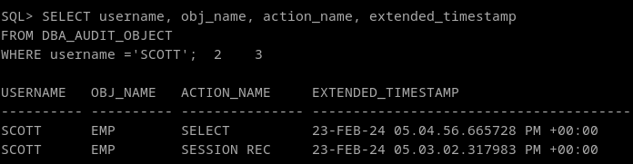

# 5. Explica la diferencia entre auditar una operación by access o by session ilustrándolo con ejemplos.

La diferencia es que las operaciones by access auditan por cada acceso al objeto, operación o conexión, mientras que by session, audita por cada sesión de usuario. Funcionalmente, auditar por sesión, en versiones mas antiguas, hacía que la base de datos escribira un único registro para todas las ocurrencias registradas del mismo tipo ejecutadas en la misma sesión, y en el mismo esquema, y auditar por acceso implica que oracle escriba un registro para cada declaración y operación auditada en general.

Hoy en dia, tanto by session como by access, auditan un registro por cada operación, basicamente matando la funcionalidad del "by session." De hecho, al no especificar nada,oracle automáticamente la pondrá by access. La única diferencia es lo que muestra la columna action_name, que mostrará el valor "SESSION REC"

NOTA: BY SESSION no funciona con operaciones DML

```
AUDIT SELECT ON scott.emp BY SESSION;
```

Despues como scott:
```
SELECT * FROM emp 
```

Despues:

```
AUDIT SELECT ON scott.emp BY ACCESS;
```

Y por último, como scott:
```
SELECT * FROM emp 
```

y volvemos a comprobar el audit log, para ver que ambos registros se han guardado con un action_name diferente, un session rec genérico y uno de select:

```
SELECT username, obj_name, action_name, extended_timestamp 
FROM DBA_AUDIT_OBJECT
WHERE username ='SCOTT';
```



