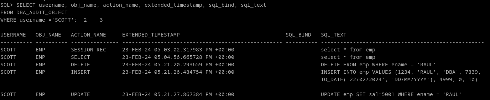

# 6. Documenta las diferencias entre los valores db y db, extended del parámetro audit_trail de ORACLE. Demuéstralas poniendo un ejemplo de la información sobre una operación concreta recopilada con cada uno de ellos.

El db, extended es un valor posible de audit_trail, que añade dos columnas a la tabla aud$: sql_bind y sql_text, junto a todas sus vistas

**sql_bind**
Un registro crea una variable de entorno de tipo cursor. El nombre de este cursor (valor de la columna) hace referencia a un registro de la vista V$SQL_BIND_DATA.

**sql_text**
La sentencia sql que ha generado el registro en primer lugar.

Para activar el audit extendido utilizamos:

```
ALTER SYSTEM SET audit_trail=db,extended scope=spfile;
```

Una vez activa, Generamos registros de ejercicios anteriores en la tabla aud$ y vemos los valores que nos ha dado:
```
SELECT username, obj_name, action_name, extended_timestamp, sql_bind, sql_text 
FROM DBA_AUDIT_OBJECT
WHERE username ='SCOTT';
```


