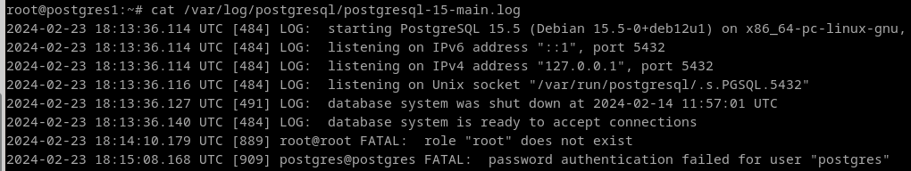
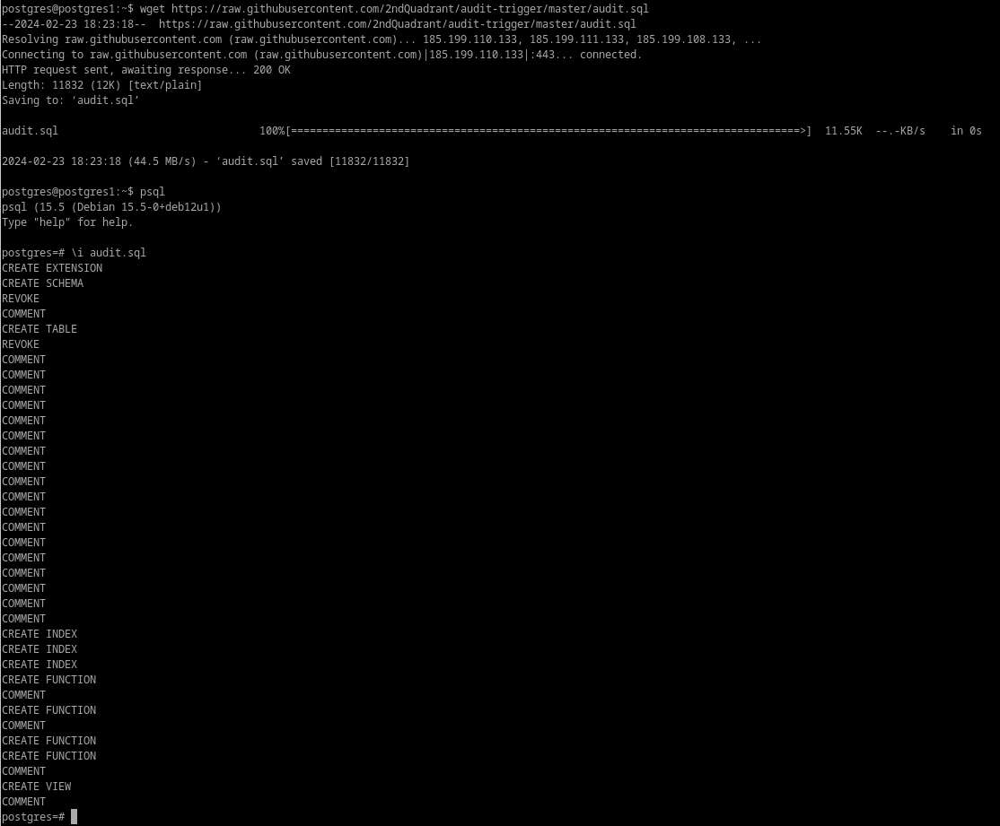
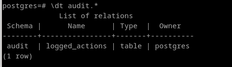
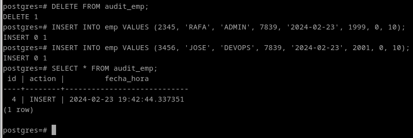

# 7. Averigua si en Postgres se pueden realizar los cuatro primeros apartados. Si es así, documenta el proceso adecuadamente.

### Ejercicio 1.

En postgres, la auditoría se hace por ficheros de log.

```
cat /var/log/postgresql/postgresql-15-main.log
```




### Ejercicio 2.

No se puede hacer un procedimiento como el de oracle, ya que los accesos fallidos no están registrados en la base de datos, si no fuera. Sin embargo, como vemos en la captura del ejercicio 1 en postgres, ya es suficientemte detallado.

### Ejercicio 3. 

A parte del log, postgres no contempla auditorías. Para ello deberíamos descargar una extensión de la comunidad para lograr esto.

```
wget https://raw.githubusercontent.com/2ndQuadrant/audit-trigger/master/audit.sql

\i audit.sql
```



Este script ha creado un esquema llamado audit y se han definido funciones y procedimientos para la auditoría

```
\dt audit.*
```



Ahora, ya que queremos auditar sobre las operaciones que haga scott, controlaremos las tablas de su esquema.
```
SELECT audit.audit_table('scott.emp');
SELECT audit.audit_table('scott.dept');
```

### Ejercicio 4.

No hay manera nativa, Las auditorías de grano fino son cosa de oracle. Lo que si se podría hacer es crear una tabla y un trigger de auditoría para lograr un resultado similar:

```
CREATE TABLE audit_emp (
  id SERIAL PRIMARY KEY,
  action VARCHAR(50),
  fecha_hora TIMESTAMP DEFAULT NOW()
);
```

```
CREATE OR REPLACE FUNCTION sal_mayor_de_2000()
RETURNS TRIGGER AS $$
BEGIN
  INSERT INTO audit_emp (action)
  VALUES (TG_OP);
  RETURN NEW;
END;
$$ LANGUAGE plpgsql;

CREATE OR REPLACE TRIGGER trigger_2000
AFTER INSERT OR UPDATE ON EMP
FOR EACH ROW
WHEN (NEW.SAL > 2000)
EXECUTE FUNCTION sal_mayor_de_2000();
```

```
INSERT INTO emp VALUES (2345, 'RAFA', 'ADMIN', 7839, '2024-02-23', 1999, 0, 10);
INSERT INTO emp VALUES (3456, 'JOSE', 'DEVOPS', 7839, '2024-02-23', 2001, 0, 10);
SELECT * FROM audit_emp;
```



NOTA: La tabla está reducida para los propósitos de este ejercicio y no contiene toda la información que debería.