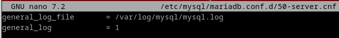
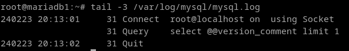
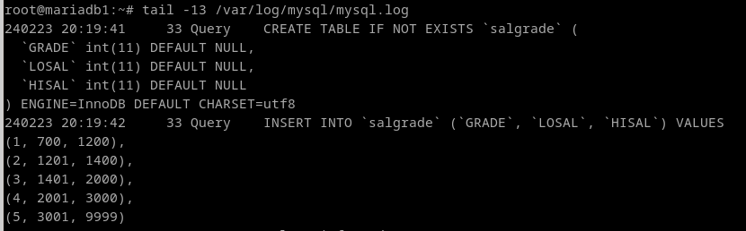

# 8. Averigua si en MySQL se pueden realizar los apartados 1, 3 y 4. Si es así, documenta el proceso adecuadamente.

### Ejercicio 1

Para activar la auditoría en mariadb, modificamos el fichero /etc/mysql/mariadb.conf.d/50-server.cnf para descomentar las lineas referentes al log:



Reiniciamos el servicio. Creamos los ficheros, damos permisos...
```
mkdir /var/log/mysql
touch /var/log/mysql/mysql.log
chown -R /var/log/mysql/
systemctl restart mysql
mysql -u root
tail -3 /var/log/mysql/mysql.log
```



### Ejercicio 3

En el log de maríadb también se recogen las sentencias sql.



### Ejercicio 4

Una vez mas, Habría que tirar de triggers, ya que la auditoría de grano fino es cosa de oracle.

