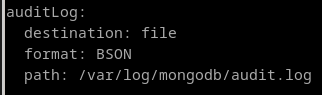

# 9. Averigua las posibilidades que ofrece MongoDB para auditar los cambios que va sufriendo un documento. Demuestra su funcionamiento.

La auditoría se define con el binario para el daemon.

```
mongod --auditDestination [ syslog | console | file ] --auditFormat [ JSON | BSON ] --auditPath (Ruta)
```

En mi caso, será esto:

```
mongod --dbpath /var/log/mongodb --auditDestination file --auditFormat BSON --auditPath /var/log/mongodb/audit.log
```

Se definirá esta configuración desde /etc/mongod.conf:



Acepta que el formato sea tanto **JSON** como **BSON**, pero es recomendable lo segundo por rendimiento.